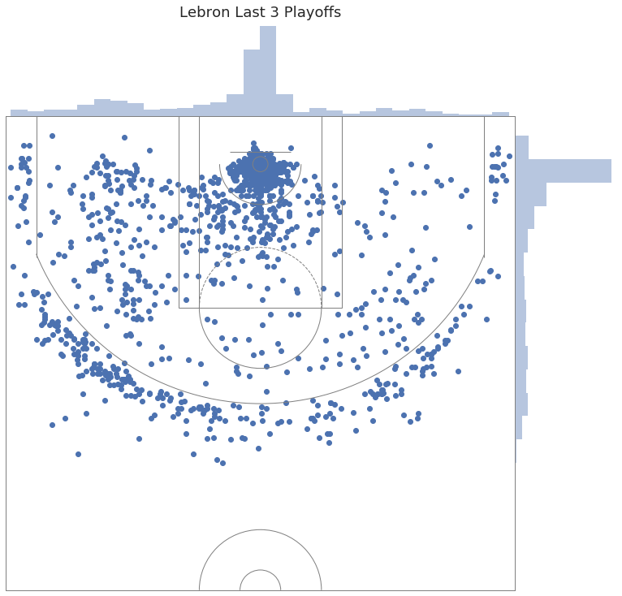
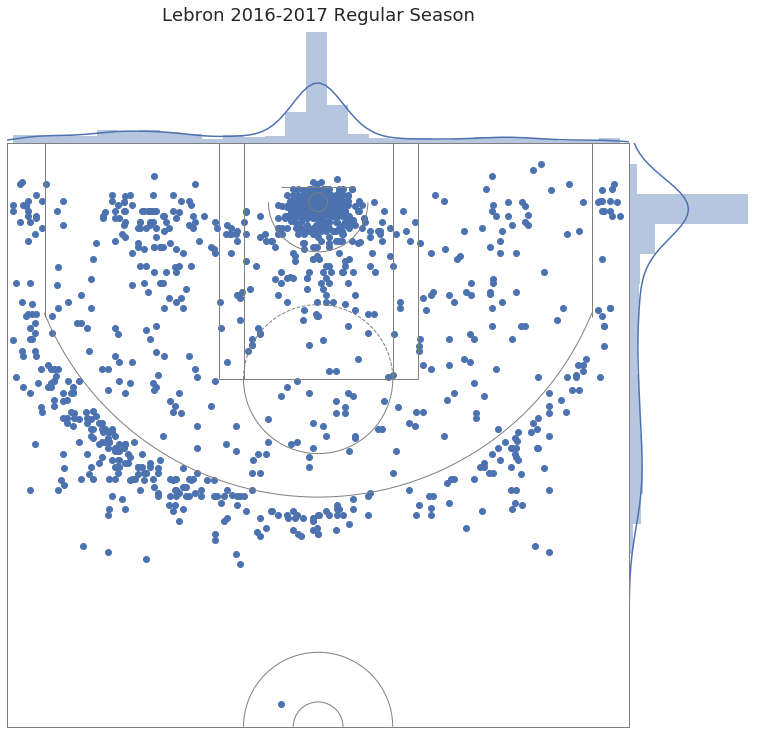
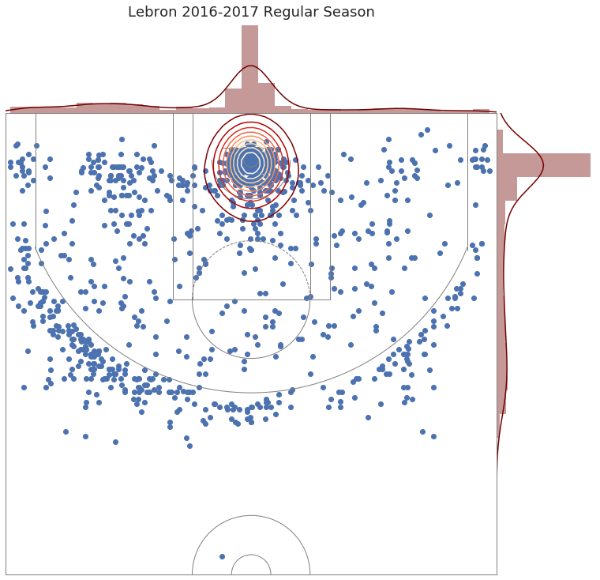
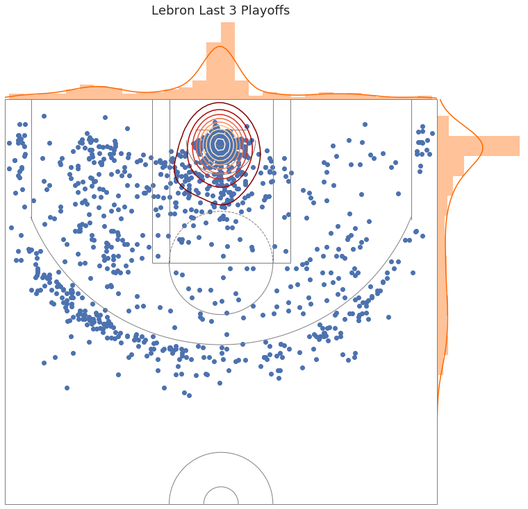
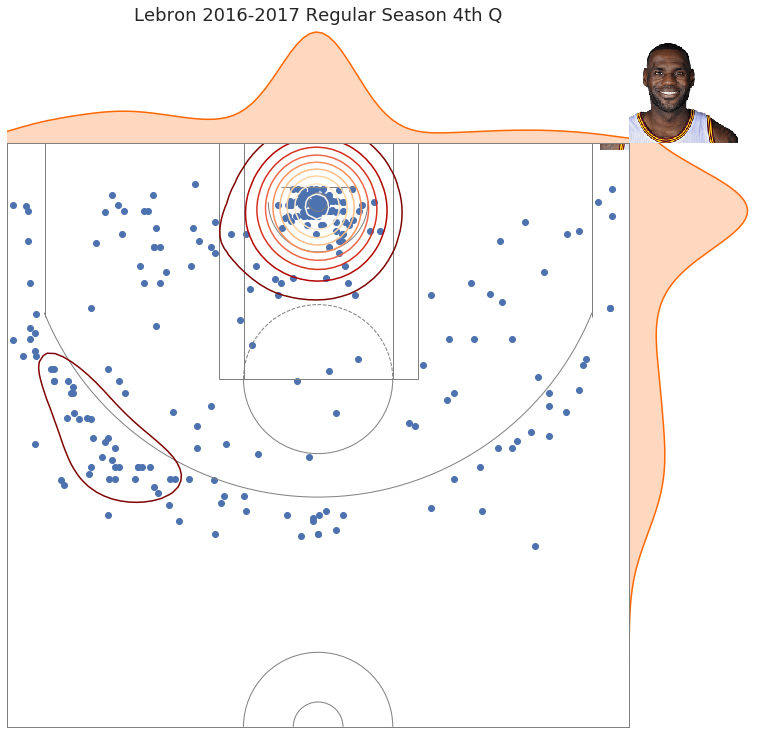
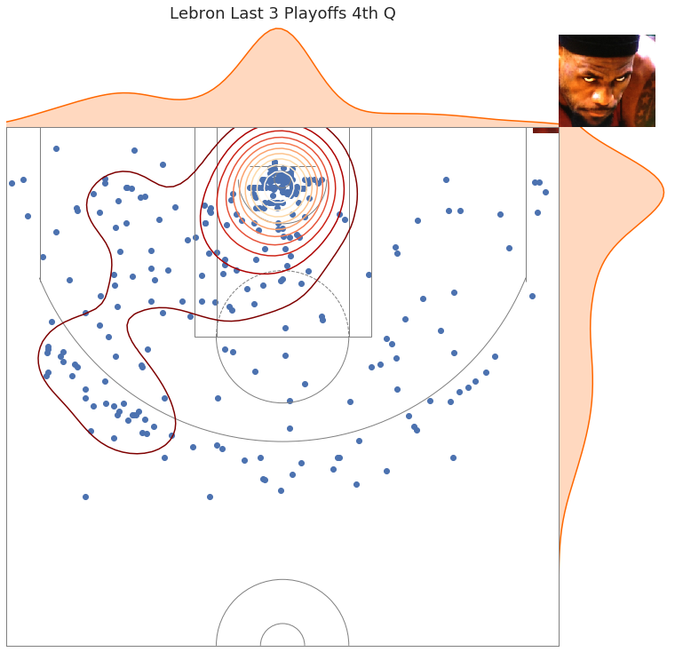

## __Intro to Data Science:__
### Testing Intuition w/ Visualization

# How data science workflows are supposed to go:

### 1) Get data.

### 2) Look at numbers.

### 3) Do Math!

### 4) Visualize results.

# How they actually go:

### 1) Figure out how you're going to get data.

### 2) Spend a lot of time cleaning data.

### 3) Look at what are supposed to be numbers.

### 4) Spend more time cleaning and getting data that you found out you need.

### 5) Visualize.

### 6) Clean + Splice _creatively._

### 7) DO MATH!

### 8) Rinse and repeat steps 3-7 until deadline,

_For everyone's sake, we're not really going to get into steps 1 and 2._

## So the first (and usually hardest) step is to pick a problem. Make it one you're interested in - but don't tie yourself down to it. 

### A good problem changes as you dig deeper into it. 


I'm a (recovering) NBA addict, so I'm picking something basketball related.

### What is playoff Lebron?

## Step 1: Get the data.

### Forget what I said earlier - this is the hardest part.

## Thankfully, smart people are working on problems like this, so for the purposes of this talk, it's going to be solved by nba_py: https://github.com/seemethere/nba_py


```python
import nba_helper_functions
from nba_py import  team, game
import pandas as pd
import numpy as  np
import plotly.plotly as py
import plotly.graph_objs as go
import matplotlib.pyplot as plt
import seaborn as sns
import pandas as pd
import nbashots as nba # this will throw a warning if using matplotlib 1.5
import requests as r
%matplotlib inline
```


```python
cavs_id =  1610612739
```

# Step 2: Splice and clean the data:

Writing helper functions counts as cleaning.


```python
def lebron_data(season, season_type):
    """Gets info on all cavs games, and returns dataframe with only Lebron's statistics"""
    val = team.TeamGameLogs(cavs_id, season=season, season_type = season_type)
    game_ids = val.info()['Game_ID'].tolist()
    data = pd.DataFrame()
    for id in game_ids:
        all_players = game.PlayerTracking(id).info()[['GAME_ID', 'PLAYER_ID', 'MIN', 'SPD', 'TCHS', 'PASS', 'AST', 'CFGM', 'CFGA', 'UFGM', 'UFGA']]
        lebron = all_players.loc[all_players['PLAYER_ID'] == 2544]
        #this gets some player tracking stats; average speed, touches, passes, assists, and some shot info.
        data = data.append(lebron)
    return data
```


```python
df_playoffs =  pd.DataFrame()
playoff_seasons = ['2014-15', '2015-16', '2016-17']
for season in  playoff_seasons:
    df = lebron_data(season, 'Playoffs')
    df_playoffs =  df_playoffs.append(df)
```


```python
df_regular_season = lebron_data('2016-17', 'Regular Season')
```


```python
df_playoffs.head()
```


<div>
<style>
    .dataframe thead tr:only-child th {
        text-align: right;
    }

    .dataframe thead th {
        text-align: left;
    }

    .dataframe tbody tr th {
        vertical-align: top;
    }
</style>
<table border="1" class="dataframe">
  <thead>
    <tr style="text-align: right;">
      <th></th>
      <th>GAME_ID</th>
      <th>PLAYER_ID</th>
      <th>MIN</th>
      <th>SPD</th>
      <th>TCHS</th>
      <th>PASS</th>
      <th>AST</th>
      <th>CFGM</th>
      <th>CFGA</th>
      <th>UFGM</th>
      <th>UFGA</th>
    </tr>
  </thead>
  <tbody>
    <tr>
      <th>13</th>
      <td>0041400406</td>
      <td>2544</td>
      <td>46:42</td>
      <td>3.85</td>
      <td>127</td>
      <td>75</td>
      <td>9</td>
      <td>9</td>
      <td>18</td>
      <td>4</td>
      <td>15</td>
    </tr>
    <tr>
      <th>0</th>
      <td>0041400405</td>
      <td>2544</td>
      <td>44:46</td>
      <td>4.02</td>
      <td>119</td>
      <td>73</td>
      <td>11</td>
      <td>9</td>
      <td>24</td>
      <td>6</td>
      <td>10</td>
    </tr>
    <tr>
      <th>13</th>
      <td>0041400404</td>
      <td>2544</td>
      <td>40:55</td>
      <td>3.84</td>
      <td>118</td>
      <td>80</td>
      <td>8</td>
      <td>5</td>
      <td>13</td>
      <td>2</td>
      <td>9</td>
    </tr>
    <tr>
      <th>13</th>
      <td>0041400403</td>
      <td>2544</td>
      <td>45:60</td>
      <td>3.68</td>
      <td>111</td>
      <td>56</td>
      <td>8</td>
      <td>9</td>
      <td>24</td>
      <td>5</td>
      <td>10</td>
    </tr>
    <tr>
      <th>0</th>
      <td>0041400402</td>
      <td>2544</td>
      <td>50:20</td>
      <td>3.89</td>
      <td>131</td>
      <td>73</td>
      <td>11</td>
      <td>4</td>
      <td>22</td>
      <td>7</td>
      <td>13</td>
    </tr>
  </tbody>
</table>
</div>


Now that we've gotten a good chunk, it's time to clean!


```python
#Filtering out rest games
df_regular_season = df_regular_season[df_regular_season['SPD'] != 0]
```


```python
def hh_mm_ss2seconds(hh_mm_ss):
    import functools
    return functools.reduce(lambda min, sec: (min*60 + sec)/60.0, map(int, hh_mm_ss.split(':')))
```


```python
df_playoffs['MIN'] = df_playoffs['MIN'].map(lambda x: hh_mm_ss2seconds(x))
df_regular_season['MIN'] = df_regular_season['MIN'].map(lambda x: hh_mm_ss2seconds(x))
```

### Step 3: Numbers!


```python
df_playoffs.describe()
```


<div>
<style>
    .dataframe thead tr:only-child th {
        text-align: right;
    }

    .dataframe thead th {
        text-align: left;
    }

    .dataframe tbody tr th {
        vertical-align: top;
    }
</style>
<table border="1" class="dataframe">
  <thead>
    <tr style="text-align: right;">
      <th></th>
      <th>PLAYER_ID</th>
      <th>MIN</th>
      <th>SPD</th>
      <th>TCHS</th>
      <th>PASS</th>
      <th>AST</th>
      <th>CFGM</th>
      <th>CFGA</th>
      <th>UFGM</th>
      <th>UFGA</th>
    </tr>
  </thead>
  <tbody>
    <tr>
      <th>count</th>
      <td>59.0</td>
      <td>59.000000</td>
      <td>59.000000</td>
      <td>59.000000</td>
      <td>59.000000</td>
      <td>59.000000</td>
      <td>59.000000</td>
      <td>59.000000</td>
      <td>59.000000</td>
      <td>59.000000</td>
    </tr>
    <tr>
      <th>mean</th>
      <td>2544.0</td>
      <td>40.860169</td>
      <td>3.771695</td>
      <td>95.457627</td>
      <td>60.813559</td>
      <td>7.966102</td>
      <td>6.779661</td>
      <td>13.152542</td>
      <td>4.457627</td>
      <td>9.644068</td>
    </tr>
    <tr>
      <th>std</th>
      <td>0.0</td>
      <td>4.832949</td>
      <td>0.113033</td>
      <td>16.686069</td>
      <td>11.075718</td>
      <td>2.652040</td>
      <td>2.297433</td>
      <td>4.509811</td>
      <td>1.976779</td>
      <td>3.325776</td>
    </tr>
    <tr>
      <th>min</th>
      <td>2544.0</td>
      <td>28.133333</td>
      <td>3.570000</td>
      <td>57.000000</td>
      <td>37.000000</td>
      <td>3.000000</td>
      <td>2.000000</td>
      <td>5.000000</td>
      <td>1.000000</td>
      <td>4.000000</td>
    </tr>
    <tr>
      <th>25%</th>
      <td>2544.0</td>
      <td>38.966667</td>
      <td>3.700000</td>
      <td>86.000000</td>
      <td>53.000000</td>
      <td>6.000000</td>
      <td>5.000000</td>
      <td>10.000000</td>
      <td>3.000000</td>
      <td>8.000000</td>
    </tr>
    <tr>
      <th>50%</th>
      <td>2544.0</td>
      <td>41.250000</td>
      <td>3.770000</td>
      <td>94.000000</td>
      <td>60.000000</td>
      <td>8.000000</td>
      <td>7.000000</td>
      <td>13.000000</td>
      <td>4.000000</td>
      <td>9.000000</td>
    </tr>
    <tr>
      <th>75%</th>
      <td>2544.0</td>
      <td>44.750000</td>
      <td>3.840000</td>
      <td>104.500000</td>
      <td>67.000000</td>
      <td>9.000000</td>
      <td>8.000000</td>
      <td>16.000000</td>
      <td>6.000000</td>
      <td>11.500000</td>
    </tr>
    <tr>
      <th>max</th>
      <td>2544.0</td>
      <td>50.333333</td>
      <td>4.130000</td>
      <td>140.000000</td>
      <td>86.000000</td>
      <td>14.000000</td>
      <td>12.000000</td>
      <td>26.000000</td>
      <td>9.000000</td>
      <td>21.000000</td>
    </tr>
  </tbody>
</table>
</div>


```python
df_regular_season.describe()
```


<div>
<style>
    .dataframe thead tr:only-child th {
        text-align: right;
    }

    .dataframe thead th {
        text-align: left;
    }

    .dataframe tbody tr th {
        vertical-align: top;
    }
</style>
<table border="1" class="dataframe">
  <thead>
    <tr style="text-align: right;">
      <th></th>
      <th>PLAYER_ID</th>
      <th>MIN</th>
      <th>SPD</th>
      <th>TCHS</th>
      <th>PASS</th>
      <th>AST</th>
      <th>CFGM</th>
      <th>CFGA</th>
      <th>UFGM</th>
      <th>UFGA</th>
    </tr>
  </thead>
  <tbody>
    <tr>
      <th>count</th>
      <td>74.0</td>
      <td>74.000000</td>
      <td>74.000000</td>
      <td>74.000000</td>
      <td>74.000000</td>
      <td>74.000000</td>
      <td>74.000000</td>
      <td>74.000000</td>
      <td>74.000000</td>
      <td>74.000000</td>
    </tr>
    <tr>
      <th>mean</th>
      <td>2544.0</td>
      <td>37.764640</td>
      <td>3.755135</td>
      <td>88.743243</td>
      <td>59.472973</td>
      <td>8.729730</td>
      <td>5.810811</td>
      <td>9.635135</td>
      <td>4.135135</td>
      <td>8.527027</td>
    </tr>
    <tr>
      <th>std</th>
      <td>0.0</td>
      <td>4.592402</td>
      <td>0.140540</td>
      <td>14.464942</td>
      <td>11.922378</td>
      <td>3.401439</td>
      <td>2.181339</td>
      <td>3.287895</td>
      <td>2.029403</td>
      <td>2.800308</td>
    </tr>
    <tr>
      <th>min</th>
      <td>2544.0</td>
      <td>27.266667</td>
      <td>3.330000</td>
      <td>50.000000</td>
      <td>30.000000</td>
      <td>2.000000</td>
      <td>1.000000</td>
      <td>3.000000</td>
      <td>0.000000</td>
      <td>3.000000</td>
    </tr>
    <tr>
      <th>25%</th>
      <td>2544.0</td>
      <td>35.408333</td>
      <td>3.660000</td>
      <td>80.250000</td>
      <td>54.000000</td>
      <td>6.000000</td>
      <td>4.000000</td>
      <td>7.000000</td>
      <td>3.000000</td>
      <td>7.000000</td>
    </tr>
    <tr>
      <th>50%</th>
      <td>2544.0</td>
      <td>38.083333</td>
      <td>3.750000</td>
      <td>89.000000</td>
      <td>58.000000</td>
      <td>8.000000</td>
      <td>6.000000</td>
      <td>9.500000</td>
      <td>4.000000</td>
      <td>8.000000</td>
    </tr>
    <tr>
      <th>75%</th>
      <td>2544.0</td>
      <td>40.000000</td>
      <td>3.850000</td>
      <td>97.000000</td>
      <td>65.750000</td>
      <td>11.000000</td>
      <td>8.000000</td>
      <td>11.000000</td>
      <td>5.000000</td>
      <td>10.750000</td>
    </tr>
    <tr>
      <th>max</th>
      <td>2544.0</td>
      <td>51.650000</td>
      <td>4.080000</td>
      <td>136.000000</td>
      <td>101.000000</td>
      <td>17.000000</td>
      <td>10.000000</td>
      <td>18.000000</td>
      <td>9.000000</td>
      <td>17.000000</td>
    </tr>
  </tbody>
</table>
</div>


### Step 4: Some more splicing:


```python
df_playoffs.describe() - df_regular_season.describe() 
```


<div>
<style>
    .dataframe thead tr:only-child th {
        text-align: right;
    }

    .dataframe thead th {
        text-align: left;
    }

    .dataframe tbody tr th {
        vertical-align: top;
    }
</style>
<table border="1" class="dataframe">
  <thead>
    <tr style="text-align: right;">
      <th></th>
      <th>PLAYER_ID</th>
      <th>MIN</th>
      <th>SPD</th>
      <th>TCHS</th>
      <th>PASS</th>
      <th>AST</th>
      <th>CFGM</th>
      <th>CFGA</th>
      <th>UFGM</th>
      <th>UFGA</th>
    </tr>
  </thead>
  <tbody>
    <tr>
      <th>count</th>
      <td>-15.0</td>
      <td>-15.000000</td>
      <td>-15.000000</td>
      <td>-15.000000</td>
      <td>-15.000000</td>
      <td>-15.000000</td>
      <td>-15.000000</td>
      <td>-15.000000</td>
      <td>-15.000000</td>
      <td>-15.000000</td>
    </tr>
    <tr>
      <th>mean</th>
      <td>0.0</td>
      <td>3.095530</td>
      <td>0.016560</td>
      <td>6.714384</td>
      <td>1.340586</td>
      <td>-0.763628</td>
      <td>0.968850</td>
      <td>3.517407</td>
      <td>0.322492</td>
      <td>1.117041</td>
    </tr>
    <tr>
      <th>std</th>
      <td>0.0</td>
      <td>0.240547</td>
      <td>-0.027507</td>
      <td>2.221127</td>
      <td>-0.846660</td>
      <td>-0.749400</td>
      <td>0.116095</td>
      <td>1.221916</td>
      <td>-0.052623</td>
      <td>0.525468</td>
    </tr>
    <tr>
      <th>min</th>
      <td>0.0</td>
      <td>0.866667</td>
      <td>0.240000</td>
      <td>7.000000</td>
      <td>7.000000</td>
      <td>1.000000</td>
      <td>1.000000</td>
      <td>2.000000</td>
      <td>1.000000</td>
      <td>1.000000</td>
    </tr>
    <tr>
      <th>25%</th>
      <td>0.0</td>
      <td>3.558333</td>
      <td>0.040000</td>
      <td>5.750000</td>
      <td>-1.000000</td>
      <td>0.000000</td>
      <td>1.000000</td>
      <td>3.000000</td>
      <td>0.000000</td>
      <td>1.000000</td>
    </tr>
    <tr>
      <th>50%</th>
      <td>0.0</td>
      <td>3.166667</td>
      <td>0.020000</td>
      <td>5.000000</td>
      <td>2.000000</td>
      <td>0.000000</td>
      <td>1.000000</td>
      <td>3.500000</td>
      <td>0.000000</td>
      <td>1.000000</td>
    </tr>
    <tr>
      <th>75%</th>
      <td>0.0</td>
      <td>4.750000</td>
      <td>-0.010000</td>
      <td>7.500000</td>
      <td>1.250000</td>
      <td>-2.000000</td>
      <td>0.000000</td>
      <td>5.000000</td>
      <td>1.000000</td>
      <td>0.750000</td>
    </tr>
    <tr>
      <th>max</th>
      <td>0.0</td>
      <td>-1.316667</td>
      <td>0.050000</td>
      <td>4.000000</td>
      <td>-15.000000</td>
      <td>-3.000000</td>
      <td>2.000000</td>
      <td>8.000000</td>
      <td>0.000000</td>
      <td>4.000000</td>
    </tr>
  </tbody>
</table>
</div>


### (We're skipping step 5 for now- it's not fun.)

### Step 6: Time to clean+visualize (again):


```python
court_shapes =  nba_helper_functions.court_shapes()
```


```python
playoff_df = pd.DataFrame()

for season in playoff_seasons:
    df = nba_helper_functions.get_shot_info(season= season)
    playoff_df =  playoff_df.append(df)
```


```python
missed_shot_trace = go.Scatter(
    x = playoff_df[playoff_df['EVENT_TYPE'] == 'Missed Shot']['LOC_X'],
    y = playoff_df[playoff_df['EVENT_TYPE'] == 'Missed Shot']['LOC_Y'],
    mode = 'markers',
    name = 'Missed Shot',
    marker = dict(
        size = 5,
        color = 'rgba(255, 255, 0, .8)',
        line = dict(
            width = 1,
            color = 'rgb(0, 0, 0, 1)'
        )
    )
)
made_shot_trace = go.Scatter(
    x = playoff_df[playoff_df['EVENT_TYPE'] == 'Made Shot']['LOC_X'],
    y = playoff_df[playoff_df['EVENT_TYPE'] == 'Made Shot']['LOC_Y'],
    mode = 'markers',
    name = 'Made Shot',
    marker = dict(
        size = 5,
        color = 'rgba(0, 200, 100, .8)',
        line = dict(
            width = 1,
            color = 'rgb(0, 0, 0, 1)'
        )
    )
)


layout = go.Layout(
    title='Shots by Lebron Last 3 Playoff Series',
    showlegend=True,
    xaxis=dict(
        showgrid=False,
        range=[-300, 300]
    ),
    yaxis=dict(
        showgrid=False,
        range=[-100, 500]
    ),
    height=600,
    width=650,
    shapes=court_shapes
)

data = [missed_shot_trace, made_shot_trace]
 
fig = go.Figure(data=data, layout=layout)
py.iplot(fig,  filename='Lebron Playoffs Shot Chart')
```


<iframe id="igraph" scrolling="no" style="border:none;" seamless="seamless" src="https://plot.ly/~virajparekh94/573.embed" height="600px" width="650px"></iframe>


```python
regular_season = nba_helper_functions.get_shot_info(season_type = 'Regular Season')
```


```python
missed_shot_trace = go.Scatter(
    x = regular_season[regular_season['EVENT_TYPE'] == 'Missed Shot']['LOC_X'],
    y = regular_season[regular_season['EVENT_TYPE'] == 'Missed Shot']['LOC_Y'],
    mode = 'markers',
    name = 'Missed Shot',
    marker = dict(
        size = 5,
        color = 'rgba(255, 255, 0, .8)',
        line = dict(
            width = 1,
            color = 'rgb(0, 0, 0, 1)'
        )
    )
)
made_shot_trace = go.Scatter(
    x = regular_season[regular_season['EVENT_TYPE'] == 'Made Shot']['LOC_X'],
    y = regular_season[regular_season['EVENT_TYPE'] == 'Made Shot']['LOC_Y'],
    mode = 'markers',
    name = 'Made Shot',
    marker = dict(
        size = 5,
        color = 'rgba(0, 200, 100, .8)',
        line = dict(
            width = 1,
            color = 'rgb(0, 0, 0, 1)'
        )
    )
)


layout = go.Layout(
    title='Shots by Lebron 2016-2017 Regular Season',
    showlegend=True,
    xaxis=dict(
        showgrid=False,
        range=[-300, 300]
    ),
    yaxis=dict(
        showgrid=False,
        range=[-100, 500]
    ),
    height=600,
    width=650,
    shapes=court_shapes
)

data = [missed_shot_trace, made_shot_trace]
 
fig = go.Figure(data=data, layout=layout)
py.iplot(fig,  filename='Lebron Regular Season Shot Chart')
```


<iframe id="igraph" scrolling="no" style="border:none;" seamless="seamless" src="https://plot.ly/~virajparekh94/575.embed" height="600px" width="650px"></iframe>


### Clearly, that showed everything that we were looking for.... so time for some _math._

#### 2-Dimensional binned statistics (a fancy way of saying 2D histogram) are useful for situations like this. 


```python
from scipy import stats
```


```python
mean, xedges, yedges, binnumber = stats.binned_statistic_2d(x=playoff_df.LOC_X, y=playoff_df.LOC_Y, values=playoff_df.SHOT_MADE_FLAG, statistic='mean', bins=35)
```


```python
data = [
    go.Heatmap(
        z=mean.T,
        x=xedges,
        y=yedges,
        colorscale='YIOrRd',
        opacity = .5,
        reversescale = True
    )
]

layout = go.Layout(
    title='Playoff Lebron Binned Heatmap Last 3 Years',
    shapes=court_shapes
)

fig = go.Figure(data=data, layout=layout)
    
py.iplot(fig, filename='Playoff Lebron Binned Heatmap Last 3 Years')

```


<iframe id="igraph" scrolling="no" style="border:none;" seamless="seamless" src="https://plot.ly/~virajparekh94/577.embed" height="525px" width="100%"></iframe>


```python
mean_reg, xedges_reg, yedges_reg, binnumber = stats.binned_statistic_2d(x=regular_season.LOC_X, y=regular_season.LOC_Y, values=regular_season.SHOT_MADE_FLAG, statistic='mean', bins=35)

data = [
    go.Heatmap(
        z=mean_reg.T,
        x=xedges_reg,
        y=yedges_reg,
        colorscale='YIOrRd',
        opacity = .5,
        reversescale = True
    )
]

layout = go.Layout(
    title='Lebron Binned Heatmap 2016-17',
    
    shapes=court_shapes
)

fig = go.Figure(data=data, layout=layout)
    
py.iplot(fig, filename='Lebron Binned Heatmap 2016-17')

```


<iframe id="igraph" scrolling="no" style="border:none;" seamless="seamless" src="https://plot.ly/~virajparekh94/579.embed" height="525px" width="100%"></iframe>


```python
from matplotlib.offsetbox import OffsetImage

grid = nba.shot_chart_jointplot(playoff_df.LOC_X, playoff_df.LOC_Y,
                                title="Lebron Last 3 Playoffs")

plt.show()
```





```python
grid = nba.shot_chart_jointgrid(regular_season.LOC_X, regular_season.LOC_Y,
                                title="Lebron 2016-2017 Regular Season")

plt.show()
```





## Time for some math!

### Everyone knows that  _guassian kernal density estimation_ work well for low dimensional vectors, right?


```python
cmap=plt.cm.gist_heat_r
grid = nba.shot_chart_jointgrid(regular_season.LOC_X, regular_season.LOC_Y,
                                title="Lebron 2016-2017 Regular Season",marginals_color=cmap(.7),
                                joint_type="scatter",joint_kde_shade=True)

grid.plot_joint(sns.kdeplot, cmap=plt.cm.OrRd_r)
plt.show()
```





```python

cmap=plt.cm.gist_heat_r
grid = nba.shot_chart_jointgrid(playoff_df.LOC_X, playoff_df.LOC_Y,
                                title="Lebron Last 3 Playoffs",
                                joint_type="scatter", marginals_color=cmap(.3), joint_kde_shade=True)


grid.plot_joint(sns.kdeplot, cmap=plt.cm.OrRd_r)
plt.show()
```





## So we're seeing a lot here, but we're still not seeing a pronounced difference  (based on my hunch that there is one). 

#### One might argue that this is classic overfitting, but that one isn't the one talking through this.


```python
reg_season_fourth =  regular_season[regular_season['PERIOD'] == 4]
```


```python
img = nba.get_player_img(2544)

cmap=plt.cm.gist_heat_r
grid = nba.shot_chart_jointgrid(reg_season_fourth.LOC_X, reg_season_fourth.LOC_Y,
                                title="Lebron 2016-2017 Regular Season 4th Q",
                                joint_type="scatter", marginals_color=cmap(.3),
                                marginals_type="kde")

grid.plot_joint(sns.kdeplot, cmap=plt.cm.OrRd_r)
offset_img = OffsetImage(img, zoom=0.6)
offset_img.set_offset((600, 584))
grid.ax_joint.add_artist(offset_img)
plt.show()
```





```python
playoff_df_fourth =  playoff_df[playoff_df['PERIOD'] == 4]
```


```python
from scipy.misc import imread
im = imread("Lebron-James-Stare_one.jpg")
```


```python
plt.rcParams['figure.figsize'] = (20, 18)

cmap=plt.cm.gist_heat_r
grid = nba.shot_chart_jointgrid(playoff_df_fourth.LOC_X, playoff_df_fourth.LOC_Y,
                                title="Lebron Last 3 Playoffs 4th Q",
                                joint_type="scatter", marginals_color=cmap(.3),
                                marginals_type="kde")

grid.plot_joint(sns.kdeplot, cmap=plt.cm.OrRd_r)
offset_img = OffsetImage(im, zoom=0.6)
offset_img.set_offset((600, 584))
grid.ax_joint.add_artist(offset_img)
plt.show()
```




